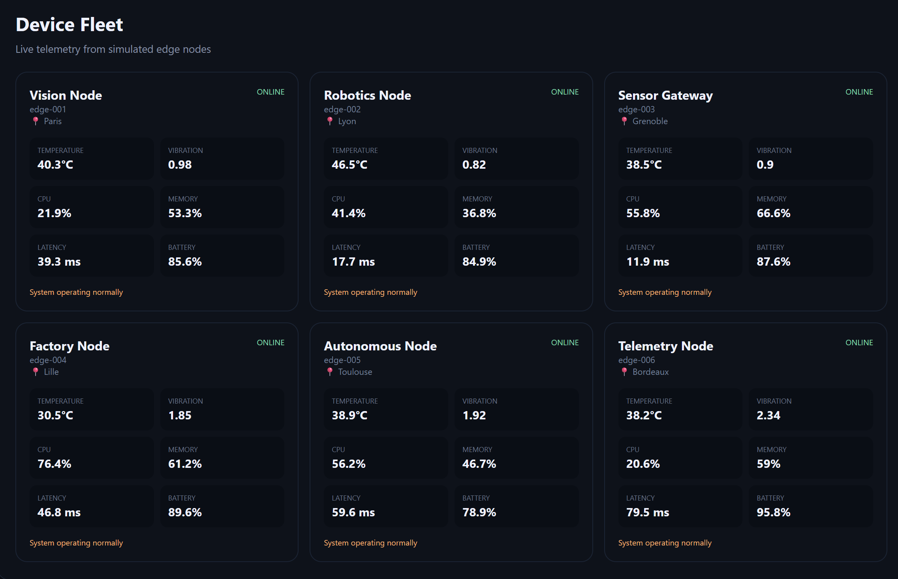

# 🛰️ EdgePulse

### Real-Time IoT & Edge Device Monitoring

> **Observe distributed devices. Stream telemetry. Detect anomalies. Understand system health.**

EdgePulse is a real-time edge-device monitoring platform that simulates a distributed fleet of IoT and edge nodes, continuously streams telemetry, detects abnormal operating conditions, and visualizes device health through a centralized dashboard.

---

## 🖥️ Dashboard



> Add your dashboard screenshot as `assets/dashboard.png`.

---

## ✨ Features

- 📡 Real-time device telemetry
- 🛰️ Distributed edge-device simulation
- 💻 CPU and memory monitoring
- 🌡️ Temperature monitoring
- 📳 Vibration monitoring
- 🔋 Battery monitoring
- 📶 Network latency monitoring
- 🚨 Anomaly detection
- 🟢 Device health states
- 🔄 WebSocket telemetry streaming
- 📊 Centralized operations dashboard

---

## 🧠 How It Works

```text
Edge Devices → Telemetry → FastAPI → Anomaly Engine
      ↓                              ↓
  Sensors                       Device Health
      └──────────────→ WebSocket → Dashboard
```

## 🛠️ Technology Stack

**Backend:** Python · FastAPI · Uvicorn · WebSockets

**Frontend:** HTML · CSS · JavaScript · WebSocket API

**Monitoring:** Real-time telemetry · Threshold-based anomaly detection · Device health monitoring

---

## 📁 Project Structure

```text
edgepulse/
├── assets/
│   └── dashboard.png
├── static/
│   ├── index.html
│   ├── style.css
│   └── app.js
├── app.py
├── simulator.py
├── anomaly.py
├── requirements.txt
├── .gitignore
├── LICENSE
└── README.md
```

---

## 🚀 Getting Started

### 1. Clone

```bash
git clone https://github.com/hadi-ce04/edgepulse.git
cd edgepulse
```

### 2. Create a virtual environment

**Windows**
```bash
python -m venv venv
venv\Scripts\activate
```

**macOS / Linux**
```bash
python3 -m venv venv
source venv/bin/activate
```

### 3. Install dependencies

```bash
pip install -r requirements.txt
```

### 4. Start the server

```bash
uvicorn app:app --reload
```

### 5. Open

```text
http://127.0.0.1:8000
```

---

## 🔄 Telemetry Pipeline

```text
Generate
   ↓
Stream
   ↓
Analyze
   ↓
Classify
   ↓
Visualize
```

The simulator continuously generates independent device telemetry. The backend processes the values, the anomaly engine evaluates operating conditions, and the browser receives updated state through a WebSocket connection.

---

## 🔮 Future Development

- 🤖 Machine-learning anomaly detection
- 📡 ESP32 / Raspberry Pi sensor integration
- 📨 MQTT communication
- 🧠 AI-powered incident explanations
- 📈 Historical telemetry analytics
- 🐳 Docker deployment
- ☁️ Cloud-connected device management

---

## 🎯 Project Focus

EdgePulse explores the intersection of:

```text
IoT
+
Edge Computing
+
Real-Time Systems
+
Automation
+
Data Analysis
+
Software Engineering
```

---

## 👨‍💻 Author

**Hadi** — Computer Engineering Student

Interested in Artificial Intelligence, Robotics, Computer Vision, Automation, IoT, Edge Computing and Real-Time Systems.

GitHub: https://github.com/hadi-ce04

---

## 📄 License

MIT License

<p align="center">

**EdgePulse 🛰️**

*Making distributed systems visible.*

</p>
